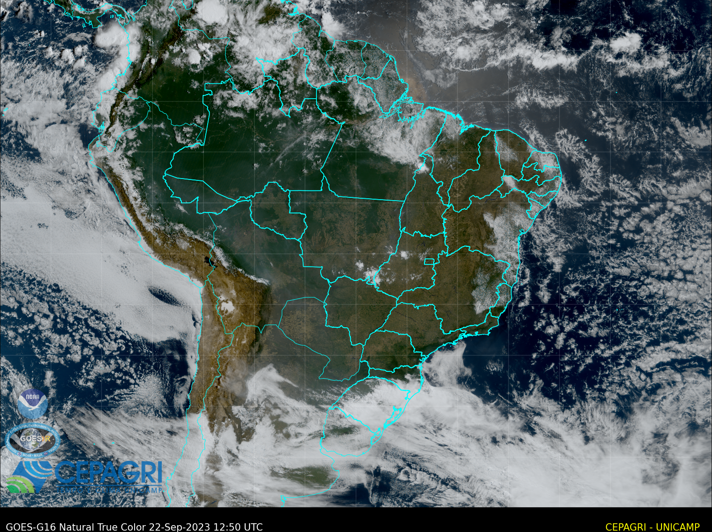
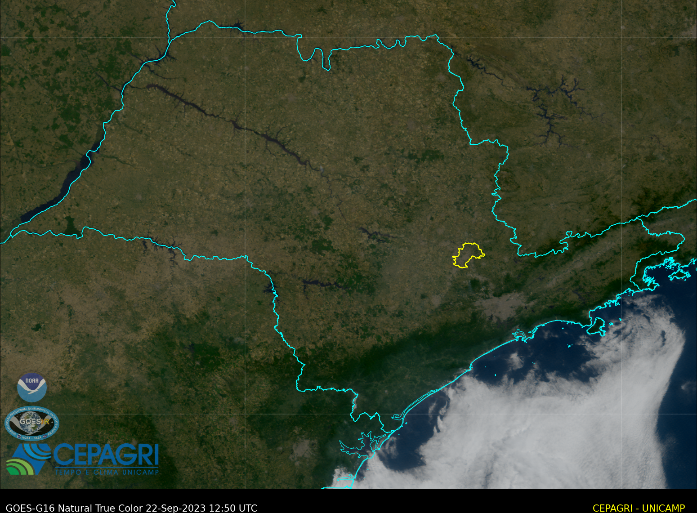
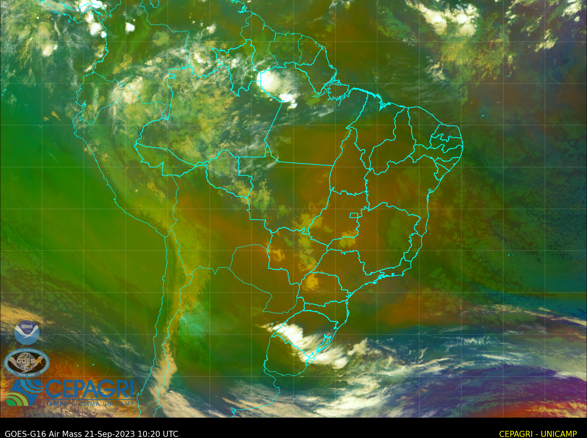
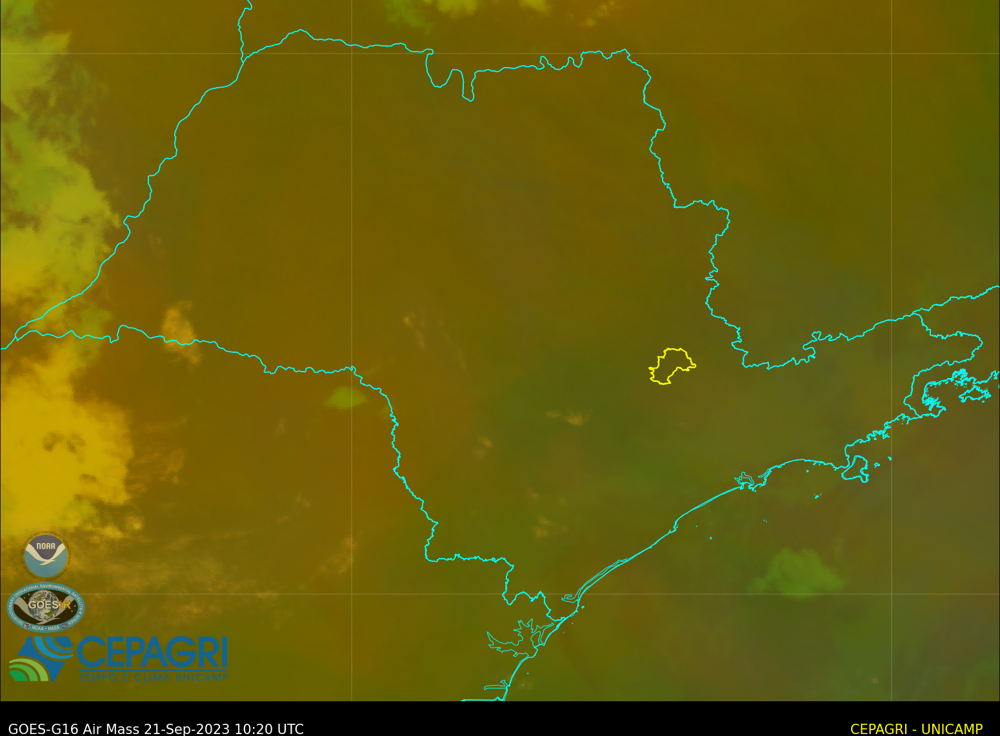
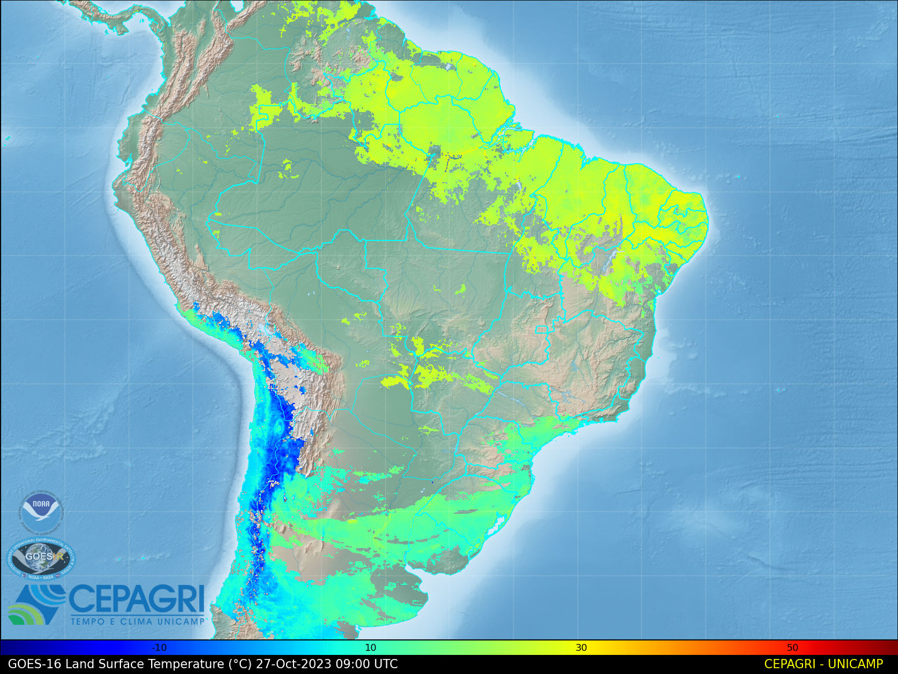
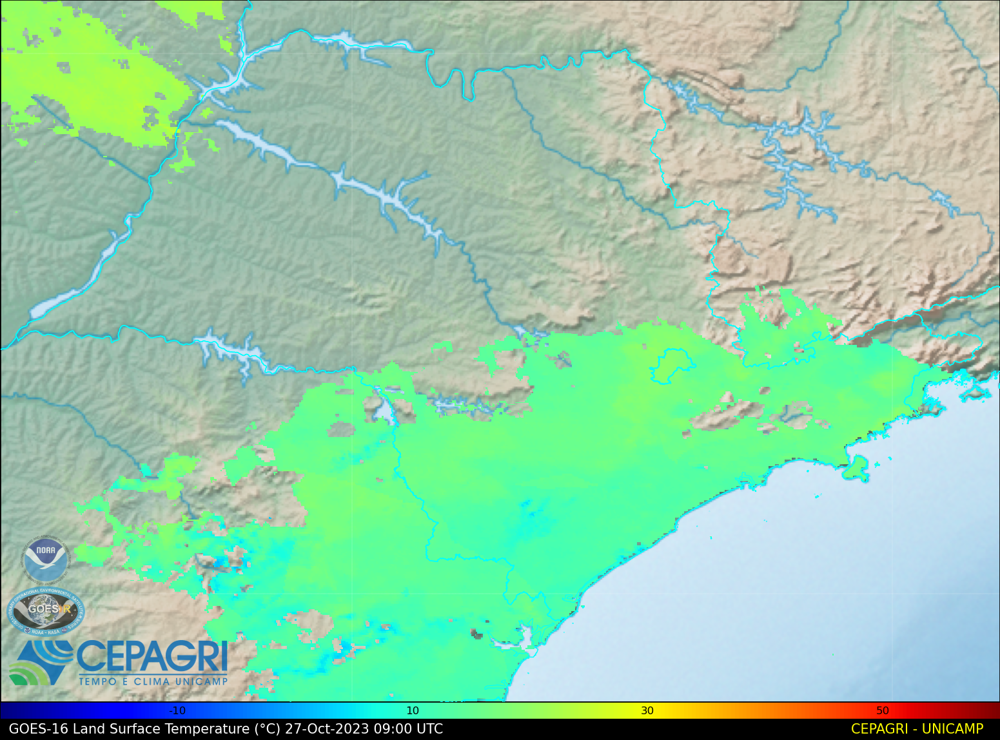

# Processamento de Imagens GOES-16

Este repositório contém código Python para processar imagens do satélite GOES-16 criando imagens True Color, Air Mass, Land Surface Temperature.

True Color: Imagens naturais da Terra. Bands necessárias 01, 02 e 03. 

True Color com Black Marble: Imagens naturais da Terra + Black Marble. Bands necessárias 01, 02, 03 e 13. 

Air Mass: Representa a distribuição vertical de massas de ar na atmosfera. Bands necessárias 08, 10, 12, 13.

Land Surface Temperature: Temperatura radiativa da pele da terra derivada da radiação solar. Bands necessárias lst.

## Estrutura de Pastas

O repositório está estruturado da seguinte forma:

```
/Goes-16-Processamento
    /colortables
    /goes
    /logos
    /Maps
    /output
    /shapefiles
    airmass_rgb.py
    dirs.py
    lst.py
    truecolor.py
    truecolorN.py
    utilities.py
    
```

- **colortables:** Contém tabelas de cores usadas no processamento.
- **goes:** Contém os arquivos netCDF para o processamento.
- **logos:** Contém logotipos para adicionar às imagens geradas.
- **Maps:** Contém rasters para o fundo das imagens.
- **shapefiles:** Contém arquivos shapefile usados para adicionar informações geográficas às imagens processadas.
- **airmass_rgb.py:** Script para processamento de imagens Air Mass.
- **lst.py:** Script para processamento de imagens Land Surface Temperature.
- **truecolor.py:** Script para processamento de imagens True Color.
- **truecolorN.py:** Script para processamento de imagens True Color + banda 13 para lugares escuros.
- **utilities.py:** Contém funções para reporjeção e outros.


## Pré-requisitos

Antes de executar os scripts, você precisa ter as seguintes bibliotecas Python instaladas:

- `matplotlib`
- `numpy`
- `netCDF4`
- `cartopy`
- `pyorbital`
- `pyspectral`
- `multiprocessing`
- `logging`
- `osgeo`


Você também pode usar ambiente conda para baixar os pacotes necessários.
- [Miniconda](https://docs.conda.io/en/latest/miniconda.html)

Você pode criar um ambiente Conda com os pacotes necessários usando o seguinte comando:

```bash
conda create --name goes -c conda-forge matplotlib netcdf4 cartopy gdal pyspectral pyorbital numpy multiprocessing osgeo
```

Para ativar este ambiente, use
```bash
conda activate goes
```
Para desativar um ambiente ativo, use
```bash
conda deactivate
```
<br>
<br>

## Instalação

1. Clone este repositório para o seu ambiente local:

```bash
git clone https://github.com/guimouraO1/Goes-16-Processamento.git
```
2. Vá para a pasta
```bash
cd /sua/pasta/Goes-16-Processamento/
```

## Configuração

Antes de executar os scripts, você precisa configurar algumas variáveis:

- `dir_main`: O diretório raiz do projeto.
- `new_bands`: Coloque os arquivos netCDF4 das bandas dentro do dicionário de dados de banda correta.
Certifique-se de que seus dados de entrada estejam disponíveis no diretório especificado em `dir_in`.

Além disso, você pode configurar as variáveis `bands` e `p_br`/`p_sp` para controlar quais bandas e regiões você deseja processar.

## Uso

Para processar as imagens, execute o script desejado `truecolor.py`, `airmass_rgb.py` ou `lst.py`.

Truecolor
```bash
python truecolor.py
```
Air Mass
```bash
python airmass_rgb.py
```
Land Surface Temperature
```bash
python lst.py
```
As imagens processadas serão salvas no diretório especificado em `dir_out`.

## Sobre o Código

Os scripts `truecolor.py` e `airmass_rgb.py` realizam o processamento das imagens True Color e Air Mass. Eles incluem funções para reprojetar dados, aplicar correções atmosféricas e criar imagens finais.

## Licença

Este código é distribuído sob a licença MIT. Consulte o arquivo LICENSE para obter mais detalhes.

---

## Exemplo: NOAA GOES-16 truecolor Processing on CEPAGRI


---

---
## Exemplo: NOAA GOES-16 Air Mass Processing on CEPAGRI


---


## Exemplo: NOAA GOES-16 Land Surface Temperature on CEPAGRI


---

---
**Author:** [Guilherme de Moura Oliveira]
**Contact:** [guimoura@unicamp.br]
**Last Updated:** [26/10/2023]

**Parte deste código foi adaptada do trabalho do** Diego Souza (github.com/diegormsouza)<br>
**Link para o código original: TrueColor** [https://github.com/diegormsouza/GOES-16-RGB-s/blob/main/g16_rgb_true_color_cartopy.py]
